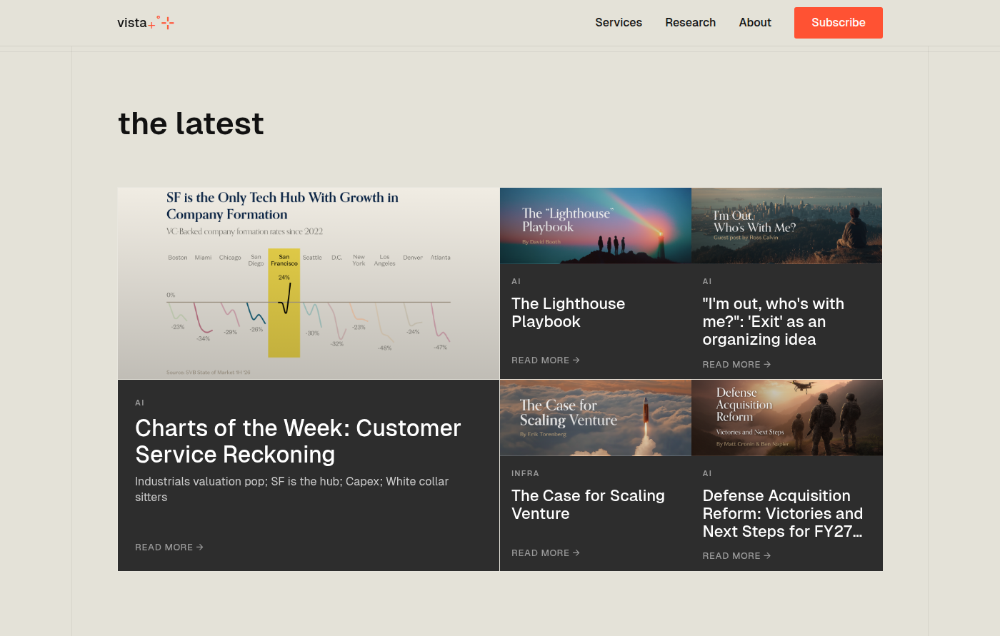
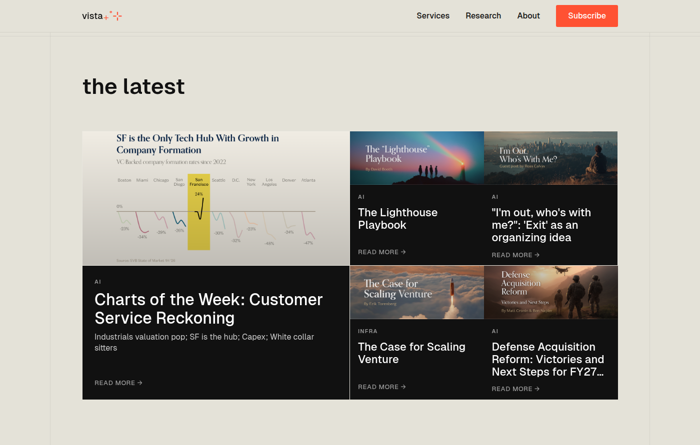
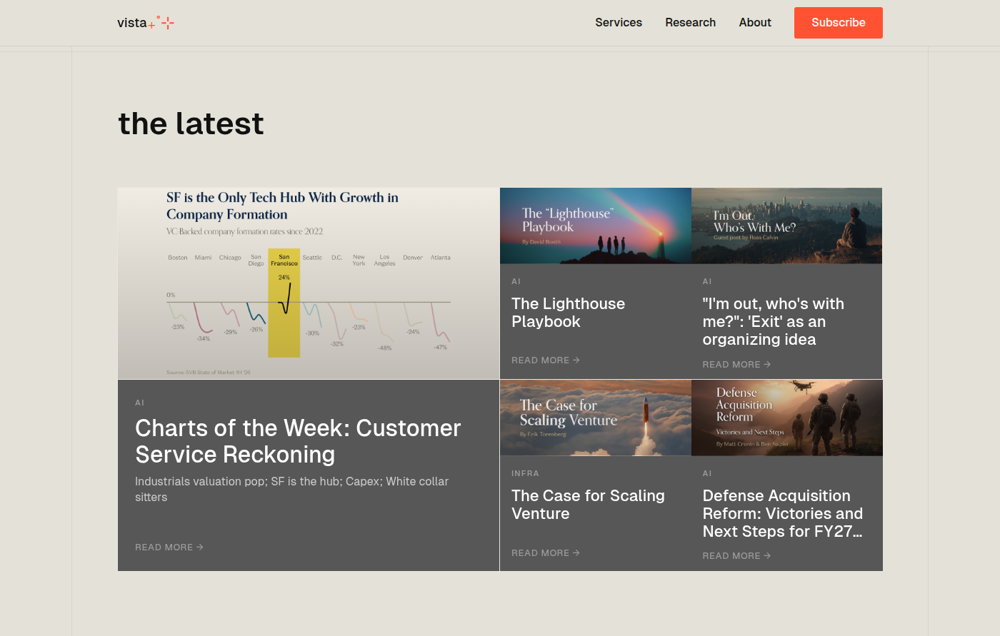

# Background Color Options Comparison
## "The Latest" Section - Alternative Backgrounds

**Context:**
- Current color (#2D2D2D) not convincing to Isaac
- Page background: #E4E2D8 (warm beige)
- All options from official Vista palette
- All tested with white text for readability

---

## Option A: #2D2D2D (IDLE GRAY) - Current


**From palette:** IDLE GRAY  
**Contrast ratio:** Medium  
**Readability:** Good - white text clearly readable  
**Visual feel:** Neutral gray, moderate contrast with beige page  
**Assessment:** Current option. Provides decent separation from page background but Isaac wants alternatives.

---

## Option B: #191919 (ULTRA GRAY)


**From palette:** ULTRA GRAY  
**Contrast ratio:** Higher than current  
**Readability:** Excellent - strong white text contrast  
**Visual feel:** Darker, more dramatic. Closer to black but not harsh  
**Assessment:** Creates stronger visual separation from beige page. More premium/sophisticated feel. Cards "pop" more against the warm background.

---

## Option C: #111111 (VISTA BLACK)


**From palette:** VISTA BLACK  
**Contrast ratio:** Highest  
**Readability:** Excellent - maximum white text contrast  
**Visual feel:** Very dark, bold, maximum contrast  
**Assessment:** Strongest separation from page background. Most dramatic option. Creates bold, high-contrast aesthetic. May feel too harsh depending on desired vibe.

---

## Option D: #575757 (MEDIUM GRAY)


**From palette:** MEDIUM GRAY  
**Contrast ratio:** Lower than current  
**Readability:** Good - white text still readable  
**Visual feel:** Lighter, softer, more subtle  
**Assessment:** Less contrast with page background. Softer, more elegant feel. Cards blend more with page, creating gentler visual hierarchy. Less "heavy" than darker options.

---

## Summary & Recommendations

**All 4 options:**
- ✅ From Vista official color palette
- ✅ White text readable on all backgrounds
- ✅ Build passes without errors
- ✅ Consistent with brand guidelines

**Visual hierarchy (darkest → lightest):**
1. **Option C** (#111111) - VISTA BLACK - Maximum contrast
2. **Option B** (#191919) - ULTRA GRAY - Strong contrast  
3. **Option A** (#2D2D2D) - IDLE GRAY - Medium contrast (current)
4. **Option D** (#575757) - MEDIUM GRAY - Softer contrast

**Decision factors:**
- **Want cards to "pop" more?** → Go darker (B or C)
- **Want softer, more elegant feel?** → Go lighter (D)
- **Want maximum drama/impact?** → Option C (VISTA BLACK)
- **Want balance between pop and elegance?** → Option B (ULTRA GRAY)

**No recommendation made** - Isaac to choose based on visual preference and desired aesthetic direction.

---

**Implementation:** Once chosen, update line 79 in `src/components/landing2/LatestSection.tsx`:
```typescript
className={`group block bg-[#CHOSEN_COLOR] hover:bg-[#HOVER_COLOR] ...`}
```

**Note:** Current hover state is #191919. May want to adjust hover color based on final choice to maintain visual feedback.
